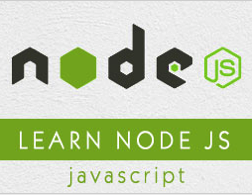

```
Roberto Nogueira  
BSd EE, MSd CE
Solution Integrator Experienced - Certified by Ericsson
```
# Tutorialspoint Node.js



**About This Course**

Learn everything you need to about Node.js.

[Node.js Tutorial](https://www.tutorialspoint.com/nodejs/index.htm)

## Topics
```
Node.js Tutorial
[ ] Home
[ ] Introduction
[ ] Environment Setup
[ ] First Application
[ ] REPL Terminal
[ ] Package Manager (NPM)
[ ] Callbacks Concept
[ ] Event Loop
[ ] Event Emitter
[ ] Buffers
[ ] Streams
[ ] File System
[ ] Global Objects
[ ] Utility Modules
[ ] Web Module
[ ] Express Framework
[ ] RESTFul API
[ ] Scaling Application
[ ] Packaging
Node.js Useful Resources
[ ] Quick Guide
[ ] Useful Resources
[ ] Dicussion
Selected Reading
[ ] Developer's Best Practices
[ ] Questions and Answers
[ ] Effective Resume Writing
[ ] HR Interview Questions
[ ] Computer Glossary
[ ] Who is Who
```
